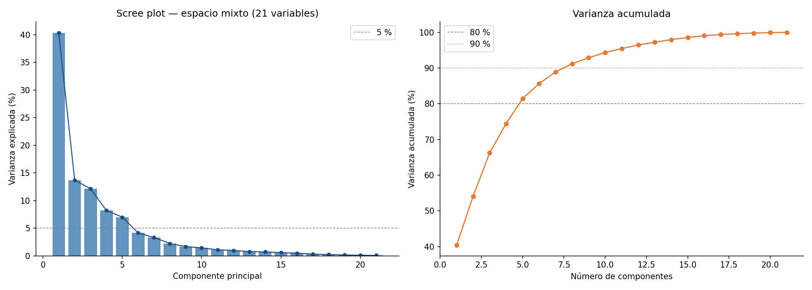
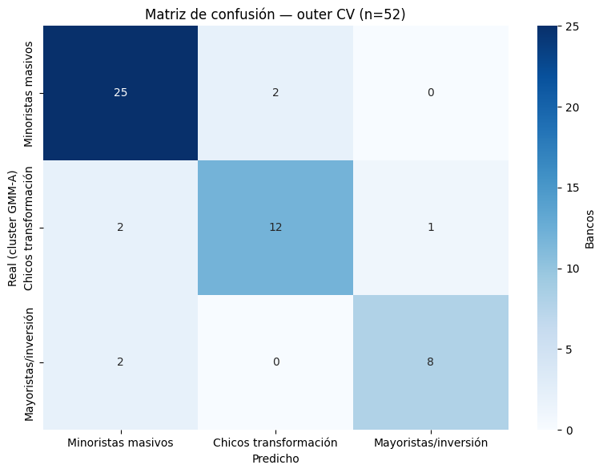
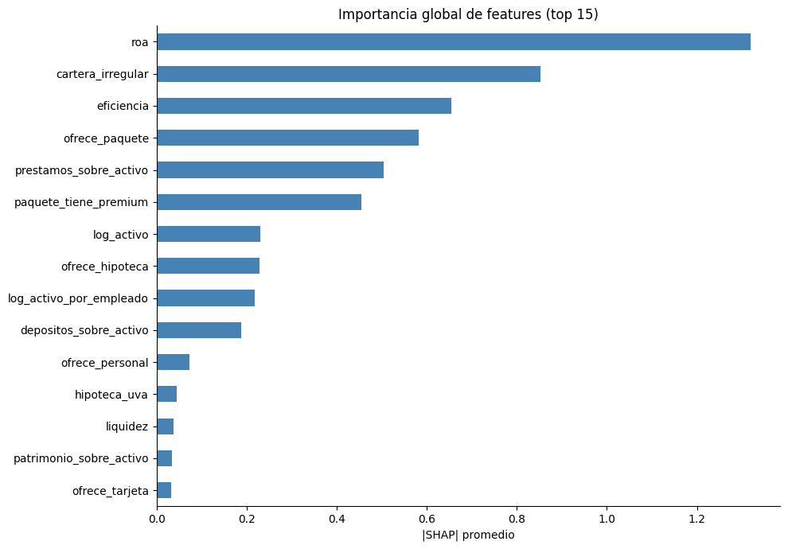
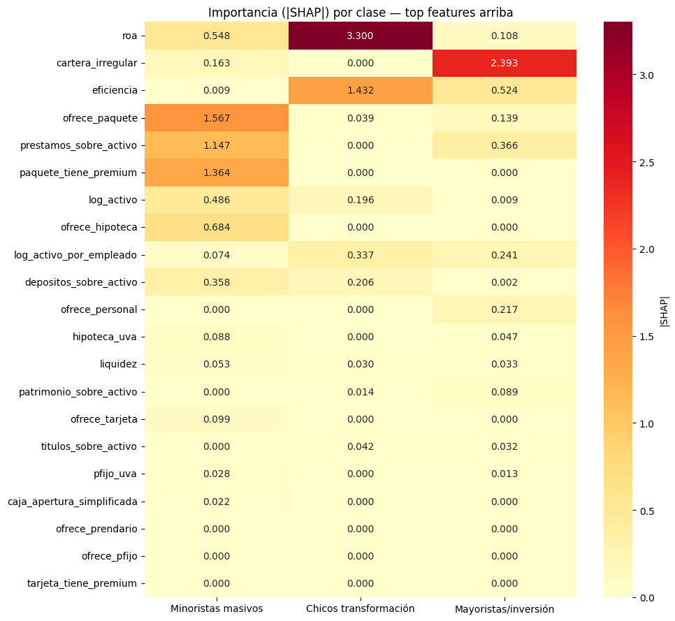

# Perfiles bancarios en Argentina: una segmentación no supervisada del sistema financiero

**Victoria Di Liscia** · Maestría en Explotación de Datos — FCEN-UBA · Taller de Tesis I — **Entrega III** · Junio 2026 · Grupo 1

> **Nota sobre esta entrega.** Documento de estructura del trabajo final: índice completo, ideas principales por sección (bullets), e introducción, marco teórico, discusión y conclusiones ya redactadas en prosa, conforme a la consigna de la Entrega III. Extensión objetivo ≤ 15 páginas. Las figuras provienen de los notebooks `02`–`06` del repositorio. Sobre esta estructura se desarrollará la redacción completa del documento final.

---

## Índice

**1. Introducción**
  - 1.1. Contexto y motivación: heterogeneidad del sistema bancario argentino
    - El promedio del sistema oculta modelos de negocio dispares
    - Relevancia macroprudencial de identificar perfiles
  - 1.2. Pregunta de investigación y objetivos
    - Objetivo general y objetivos específicos
  - 1.3. Estructura del documento

**2. Marco teórico**
  - 2.1. Relevamiento de trabajos previos
    - Roengpitya et al. (2014) — modelos de negocio bancarios (esquema choice/outcome)
    - Mercadier et al. (2025) — PCA + k-means + validación interna
    - Chherawala et al. (2025) — clustering en economía emergente (precedente cercano)
  - 2.2. Conceptos y técnicas de ciencia de datos utilizados
    - Reducción dimensional (PCA), clustering (K-Means, GMM, Ward, DBSCAN)
    - Validación supervisada (LightGBM, nested CV) e interpretabilidad (SHAP)
  - 2.3. Posicionamiento y aporte de la tesis

**3. Metodología**
  - 3.1. Presentación y descripción de los datos
    - Fuentes BCRA: portal de entidades + Régimen de Transparencia
    - Panel transversal: 168 obs. (56 bancos × 3 cortes), 13 ratios
  - 3.2. Preprocesamiento y limpieza
    - Diagnóstico de missings e imputación
    - Correcciones de signo (eficiencia) y tratamiento de cartera sin retail
  - 3.3. Análisis exploratorio (AED)
    - Estructura y concentración del sistema
    - Correlación entre ratios (Spearman) → justificación del PCA
    - Validación inferencial (Kruskal-Wallis) por tipo de entidad
    - Dinámica temporal 2023–2025 y oferta comercial
  - 3.4. Técnicas de análisis y modelado
    - Universo y espacio de features (mixto: balance + oferta)
    - Reducción dimensional y comparación sistemática de modelos de clustering
  - 3.5. Selección de características
    - Esquema choice/outcome; ponderación de binarias de oferta
  - 3.6. Métricas de evaluación
    - Internas (silhouette, Davies-Bouldin, ARI) y supervisadas (accuracy, macro-F1)
  - 3.7. Métodos estadísticos
    - Kruskal-Wallis; nested cross-validation; valores SHAP

**4. Resultados y discusión**
  - 4.1. Resultados I — Segmentación no supervisada
    - Los tres perfiles del modelo principal (05A)
    - Hallazgos estructurales (el tipo de entidad no segmenta; sub-grupo digital; outlier)
    - Modelos de contraste (03, 04, Ward, DBSCAN)
  - 4.2. Resultados II — Validación supervisada e interpretabilidad
    - Performance honesta y matriz de confusión
    - Bancos mal clasificados (los bordes esperados)
    - Importancia SHAP global y por clase ("firma" de cada perfil)
  - 4.3. Discusión de los resultados y su relevancia
    - El silhouette bajo como información, no como falla
    - Estrategia de validación triple; implicancia macroprudencial
  - 4.4. Limitaciones y posibles mejoras

**5. Conclusión**
  - 5.1. Resumen de los hallazgos principales
  - 5.2. Conclusiones generales y su relación con los objetivos
  - 5.3. Recomendaciones para futuros trabajos

**6. Bibliografía**
  - 6.1. Referencias citadas
  - 6.2. Otras fuentes consultadas

**7. Anexos**
  - 7.1. Código fuente (repositorio de notebooks 00–06)
  - 7.2. Tablas y gráficos adicionales (resúmenes por notebook)

> **Incorporación del feedback de la Entrega II.** La devolución fue positiva ("la entrega es excelente") y planteó una única observación: en la sección de concentración se dudaba si los públicos quintuplican el activo mediano de los privados nacionales o de los extranjeros. Se resuelve y precisa en §4: el activo mediano de los públicos (1.085 M) es ≈ 5× el de los privados nacionales (216 M) y ≈ 2,3× el de los extranjeros (476 M). La afirmación original refería correctamente a los privados nacionales; se reformula para que el dato no quede ambiguo respecto a la figura.

---

## 1. Introducción

### 1.1. Contexto y motivación

El sistema bancario argentino reúne alrededor de 70 entidades de naturaleza muy heterogénea —bancos públicos nacionales y provinciales, privados nacionales, filiales de bancos extranjeros y entidades de nicho— cuyos modelos de negocio un promedio agregado del sistema no alcanza a reflejar. Un banco público provincial con red de sucursales y fondeo de depósitos minoristas, un banco de inversión que opera en el mercado de capitales y una fintech 100 % digital conviven bajo la misma categoría regulatoria de "entidad financiera", pero responden a lógicas de negocio, estructuras de balance y exposiciones al riesgo radicalmente distintas. Identificar perfiles diferenciados en términos de balance, rentabilidad y riesgo crediticio tiene, por eso, implicancias directas para la política macroprudencial: permite diseñar marcos regulatorios más precisos, anticipar cómo distintos tipos de entidades responden a shocks macroeconómicos y monitorear la aparición de modelos de negocio emergentes.

Si bien la literatura internacional sobre segmentación bancaria mediante técnicas no supervisadas es robusta, su aplicación al caso argentino permanece escasa. La fuerte heterogeneidad del sistema local —marcada por alta inflación, peso del sector público, ciclos abruptos de política monetaria y un fenómeno de digitalización reciente— sugiere que los perfiles que emergerían de un análisis de este tipo serían sustantivamente distintos a los documentados en economías desarrolladas. Esto convierte a la Argentina en un caso de estudio de interés propio y no en una mera replicación de resultados conocidos. Las técnicas modernas de aprendizaje automático permiten, además, ir más allá de la mera identificación de grupos: habilitan explicar qué variables financieras definen cada perfil y con qué peso relativo, y validar que los grupos hallados no son un artefacto del algoritmo sino estructura real en los datos.

### 1.2. Pregunta de investigación y objetivos

- **Pregunta de investigación.** ¿Existen perfiles diferenciados de bancos en Argentina según balance, rentabilidad y riesgo? ¿Qué variables determinan cada perfil?
- **Objetivo general.** Identificar y caracterizar perfiles diferenciados de bancos en Argentina mediante técnicas de segmentación no supervisada, integrando información de balance con indicadores de oferta comercial pública para el período 2023–2025.
- **Objetivos específicos.**
  - Construir un dataset integrado que combine indicadores de balance con información de oferta comercial pública del Régimen de Transparencia del BCRA.
  - Describir la heterogeneidad estructural del sistema bancario argentino entre 2023 y 2025, incluyendo su dinámica temporal.
  - Aplicar y comparar algoritmos de clustering para detectar agrupamientos que no necesariamente coincidan con la clasificación administrativa por tipo de entidad.
  - Caracterizar cada cluster emergente por sus dimensiones económicas: rentabilidad, riesgo crediticio, estructura de fondeo, escala y oferta comercial.
  - **Validar** la partición resultante con un clasificador supervisado e **interpretar** los perfiles con valores SHAP, identificando las variables que definen cada uno.

### 1.3. Estructura del documento

El documento sigue el flujo del pipeline analítico: el **marco teórico** (§2) relevamiento de antecedentes y técnicas; la **metodología** (§3) describe datos, preprocesamiento, EDA y el diseño de modelado; los **resultados y la discusión** (§4) presentan la segmentación, su validación supervisada y la interpretación; la **conclusión** (§5) sintetiza hallazgos y trabajo futuro. Los **anexos** (§7) remiten al repositorio de notebooks y a los resúmenes detallados por etapa.

---

## 2. Marco teórico

### 2.1. Relevamiento de trabajos previos

La literatura sobre segmentación bancaria no supervisada ofrece a este trabajo tres aportes concretos, que se traducen en decisiones de diseño: cómo seleccionar las variables que entran al algoritmo, cómo manejar la redundancia entre ratios, y cómo validar que la partición es significativa. Se seleccionaron tres referencias que cubren, respectivamente, el diseño de variables, el pipeline metodológico, y el precedente más cercano en contexto.

- **Roengpitya, Tarashev & Tsatsaronis (2014) — *Bank business models*, BIS Quarterly Review.** Identifican tres modelos de negocio diferenciados —banca minorista, banca mayorista de fondeo, y banca de inversión orientada al trading— sobre una muestra de 222 bancos internacionales, aplicando clustering jerárquico de Ward sobre ratios de balance.
  - *Aporte central:* la distinción metodológica entre **variables de elección** —que reflejan decisiones estratégicas del banco (estructura de balance, mix de fondeo) y son las únicas que entran al algoritmo— y **variables de resultado** —rentabilidad, costos— que se reservan para caracterizar los perfiles *a posteriori*. Esta separación evita la circularidad de definir grupos a partir de las mismas dimensiones con que luego se los evalúa, y constituye la base del diseño de variables que adopta esta tesis: el ROA, por ejemplo, no entra al clustering como criterio de agrupamiento sino que se usa para describir los clusters resultantes.

- **Mercadier, Tarazi, Armand & Lardy (2025) — *Monitoring bank risk around the world using unsupervised learning*, European Journal of Operational Research.** Rankean 256 bancos de 43 países por nivel de riesgo, combinando 72 indicadores (de balance, de mercado y sistémicos) que reducen a 10 factores interpretables mediante PCA antes de aplicar k-means.
  - *Aporte 1:* respaldo empírico para usar **PCA como paso previo al clustering** cuando se trabaja con muchas variables correlacionadas, abordando explícitamente la multicolinealidad y produciendo factores con sentido económico.
  - *Aporte 2:* un marco de **validación interna** basado en silhouette y Davies-Bouldin como métricas complementarias para elegir el número de clusters. Este trabajo adopta ese marco, **con una salvedad sustantiva** (desarrollada en §8): en un sistema con continuos genuinos entre perfiles, el silhouette no puede ser el criterio decisorio único, y se complementa con validación supervisada.

- **Chherawala, Vaidya & Basu (2025) — *Multidimensional surveillance of the Indian banking system: A cluster approach*, Journal of Applied Economic Sciences.** Aplican k-means al sistema bancario indio sobre 30 bancos durante 2005–2023, comparando perfiles de riesgo entre bancos públicos y privados a lo largo de distintos episodios de estrés financiero.
  - *Aporte:* es el precedente más cercano en **escala muestral y contexto institucional** —economía emergente, presencia estatal significativa, dimensión muestral comparable a la argentina (n ≈ 30–50)—. Posiciona al clustering como instrumento de supervisión macroprudencial, capaz de informar decisiones regulatorias a partir de la identificación de perfiles de riesgo diferenciados, que es el horizonte aplicado de esta tesis.

### 2.2. Conceptos y técnicas de ciencia de datos utilizados

Síntesis de las técnicas empleadas (definiciones operativas completas en el glosario del documento final):

- **Reducción dimensional — PCA.** Transforma variables correlacionadas en componentes ortogonales que retienen la mayor parte de la varianza; mitiga la multicolinealidad antes del clustering y revela la estructura latente del sistema.
- **Clustering.**
  - *K-Means:* partición que minimiza la suma de cuadrados intracluster; eficiente y equilibrada, requiere fijar *k*.
  - *GMM (Gaussian Mixture Model):* modelo probabilístico que asigna a cada banco una **probabilidad de pertenencia** a cada grupo —clave para analizar bancos "borde" y transiciones temporales—.
  - *Ward (jerárquico) y DBSCAN (densidad):* usados como contraste para verificar que la partición no es un artefacto del algoritmo.
- **Validación supervisada.**
  - *LightGBM:* gradient boosting sobre árboles, entrenado sobre las etiquetas de cluster para comprobar que los grupos son estadísticamente diferenciables.
  - *Nested cross-validation:* estimación honesta de generalización con muestras chicas, separando la selección de hiperparámetros de la evaluación.
- **Interpretabilidad — SHAP.** Valores de Shapley que cuantifican la contribución de cada variable a la predicción, identificando qué ratios definen cada cluster.

### 2.3. Posicionamiento y aporte de la tesis

Se replica el esquema choice/outcome de Roengpitya et al. y la secuencia *reducción dimensional → clustering → validación interna* de Mercadier et al., **extendiendo** la frontera en tres direcciones: (i) se integra la **oferta comercial pública** (Régimen de Transparencia) como dimensión de segmentación, además del balance —algo ausente en los tres antecedentes—; (ii) se agrega una etapa de **validación supervisada** con LightGBM que confirma que los grupos son estadísticamente diferenciables; y (iii) se incorpora **interpretabilidad por SHAP a nivel de cada perfil**, cuantificando qué variables definen cada cluster. La combinación de validación supervisada + SHAP sobre etiquetas de clustering es el principal aporte metodológico frente a la literatura, que se detiene en la validación interna geométrica.

---

## 3. Metodología

### 3.1. Presentación y descripción de los datos

El dataset integra dos fuentes públicas del BCRA que capturan dimensiones complementarias del negocio bancario: el balance contable (qué tiene y cómo se fondea cada banco) y la oferta comercial (qué productos ofrece y bajo qué condiciones). Toda la captura y el procesamiento se documentan en los notebooks `00` (scraper) y `01` (ingesta y calidad).

- **Fuentes (dos, públicas del BCRA).**
  - *Portal de entidades financieras:* estados contables, situación de deudores y datos de estructura (dotación de personal). Capturado mediante un **scraper propio** para 56 bancos en tres cortes anuales (Dic-23, Dic-24, Dic-25).
  - *Régimen de Transparencia (Sección 36 de la normativa BCRA):* siete archivos CSV con información comercial estandarizada sobre hipotecas, préstamos personales, prendarios, plazo fijo, tarjetas, paquetes y cajas de ahorro. Cubre 51 de los 56 bancos (5 entidades no publican).
- **Integración.** La unión por código BCRA y la consolidación de los archivos de transparencia producen un **panel transversal de 168 observaciones** (56 bancos × 3 cortes) con 157 variables. Sobre el balance se construyeron **13 ratios estándar** agrupados en seis dimensiones económicas:

| Dimensión | Ratios |
|---|---|
| Rentabilidad | ROA, ROE |
| Apalancamiento | Activo / Patrimonio neto |
| Estructura de fondeo | Depósitos / Activo, Préstamos / Activo |
| Liquidez | (Efectivo + depósitos en bancos) / Depósitos |
| Eficiencia | Gastos de administración / Margen (cost-to-income) |
| Riesgo crediticio | Cartera irregular (situaciones 3-4-5) |
| Productividad | Activo / Empleado |

### 3.2. Preprocesamiento y limpieza

- **Calidad de los datos.** El diagnóstico de missings (nb 01) se concentra en tres fuentes, todas explicables y ninguna atribuible a errores de carga:
  - Cinco bancos no publican el Régimen de Transparencia → la oferta comercial queda parcialmente faltante para ~9 % de la muestra.
  - Algunos bancos pequeños no reportan dotación de personal en todos los cortes → afecta el ratio activo/empleado.
  - Entidades de muy reciente operación (digitales) tienen series incompletas en Dic-23.
  - No se detectaron datos corruptos. Los valores extremos de ROA/ROE responden a fenómenos económicos reales: pérdidas de algunos extranjeros en 2024, fin del ciclo de LELIQ. El rango de activo va de ~7 M a ~48.000 M de pesos (ratio 7.000×), lo que obliga a trabajar en **escala logarítmica** y a usar **mediana** en lugar de media en todas las comparaciones por grupo.
- **Decisiones metodológicas correctivas (nb 01–02).** Dos correcciones no triviales que afectaban la validez de los ratios:
  - *Signo de la eficiencia:* el BCRA publica egresos financieros, por servicios y gastos de administración con signo negativo en las tablas HTML. La primera corrida arrojaba eficiencias negativas (−13 % a −20 %); la versión final aplica valor absoluto sobre esas columnas antes de calcular el ratio, devolviéndolo al rango estándar ~30–80 %.
  - *Cartera irregular sin retail:* a los 4 mayoristas sin cartera minorista relevante (Bank of China, JPMorgan, BNP Paribas, Cetelem) se les asigna `NaN` en lugar de `0`, para que no aparezcan como "0 % de mora" y distorsionen las medianas por tipo.

### 3.3. Análisis exploratorio (AED)

El EDA (notebook `02`, sintetizado en `resumen_eda.md`) cumple dos funciones: documentar la heterogeneidad estructural del sistema —parte de la pregunta de investigación— y producir los insumos de diseño para el modelado (qué transformar, qué excluir, qué variables aportan señal). Los hallazgos que siguen son los que alimentan directamente las decisiones del pipeline.

- **Estructura y concentración del sistema.** El sistema es estructuralmente **competitivo pero con leve tendencia a concentrarse**: el HHI sobre activo pasa de 1.005 (Dic-23) a 1.056 (Dic-25) y la cuota de los cinco mayores bancos sube de 59,1 % a 61,4 %. Ningún tramo supera el umbral de concentración moderada (1.500).
  - **Escala por tipo de entidad (Dic-24, activo mediano):** públicos **1.085 M**, privados nacionales **216 M**, extranjeros **476 M**. Los públicos tienen un activo mediano ≈ **5× el de los privados nacionales** y ≈ **2,3× el de los extranjeros** *(precisión solicitada en la devolución de la Entrega II)*. La enorme dispersión de tamaño confirma la necesidad de tratar la escala como variable de control mediante el logaritmo del activo.
- **Estructura de correlación entre ratios (Spearman, Dic-24).** La matriz revela **tres bloques de alta colinealidad** que justifican empíricamente reducir la dimensión antes de clusterizar (en línea con Mercadier et al.):
  - *Escala:* activo, patrimonio y dotación correlacionan entre sí con ρ entre 0,91 y 0,97.
  - *Rentabilidad:* ROA y ROE con ρ = 0,92.
  - *Fondeo:* apalancamiento y depósitos/activo con ρ = 0,65.
  - La **eficiencia** correlaciona negativamente con escala (−0,61) y con rentabilidad (−0,58), confirmando su rol de ratio de costos: los bancos más grandes y rentables son más eficientes.
- **Validación inferencial — Kruskal-Wallis (Dic-24).** Para verificar formalmente que los ratios separan a los tres tipos de entidad (n = 17 públicos / 30 privados nacionales / 9 extranjeros), se aplicó el test no paramétrico de Kruskal-Wallis. **6 de 8 ratios rechazan H₀ al 5 %:**

| Variable | H | p-valor | Sig. 5 % |
|---|---:|---:|:---:|
| Liquidez | 13,33 | 0,0013 | ✅ |
| Apalancamiento | 9,10 | 0,0106 | ✅ |
| ROA | 6,85 | 0,0325 | ✅ |
| Cartera irregular | 6,67 | 0,0356 | ✅ |
| N° productos ofrecidos | 6,43 | 0,0401 | ✅ |
| ROE | 6,20 | 0,0451 | ✅ |
| Depósitos / Activo | 3,95 | 0,1386 | ❌ |
| Activo / empleado | 1,65 | 0,4391 | ❌ |

  - La **liquidez** es el ratio de mayor poder discriminante (extranjeros 33,1 % vs. públicos 13,5 %), señal de que la gestión de activos líquidos es un eje primario de diferenciación. Que depósitos/activo y activo/empleado **no** separen univariadamente anticipa un hallazgo clave: el tipo administrativo no capta el modelo de negocio, porque dentro de cada tipo hay perfiles distintos (extranjeros mayoristas vs. extranjeros retail).
- **Dinámica temporal — el sistema no es estático.** Entre Dic-23 y Dic-25:
  - El **ROA mediano cae fuerte** en los tres tipos (públicos 4,15 → 0,79; privados nacionales 3,06 → 0,35), consistente con el fin del ciclo de LELIQ.
  - La **cartera irregular se duplica** en públicos (2,33 → 5,05) y casi se duplica en privados (1,85 → 3,38).
  - El ratio **préstamos/activo sube** de ~14 % a ~38 % en privados nacionales: reactivación del crédito que aún no se traduce en rentabilidad.
  - *Implicancia de diseño:* dado que el sistema se mueve, se decidió modelar sobre el **promedio de los tres cortes** (perfil estructural estable), dejando el análisis de transiciones como extensión futura.
- **Oferta comercial (Régimen de Transparencia).** Dimensión que el balance no captura: los privados nacionales se especializan en plazo fijo (mediana de 11 variantes) y casi no ofrecen hipotecas; los públicos tienen la oferta más balanceada y son los únicos con presencia significativa en paquetes (mediana 3,5); los extranjeros muestran oferta diversificada pero acotada en cada categoría, consistente con un foco en altos ingresos. **Estas asimetrías son el argumento empírico para incorporar la oferta al vector de features.**
- **Síntesis — qué le dice el EDA al modelado.** (i) Existen al menos tres perfiles distinguibles, soportados descriptiva e inferencialmente; (ii) hay dispersión intra-tipo suficiente (sobre todo en privados nacionales) para que el clustering encuentre subgrupos que crucen la categoría administrativa; (iii) la oferta comercial agrega información independiente del balance; (iv) conviene excluir o tratar aparte los mayoristas sin cartera retail, cuyas métricas de balance minorista no aplican.

### 3.4. Técnicas de análisis y modelado

El abordaje combina ingeniería de datos sobre fuentes públicas del BCRA, análisis exploratorio para depurar variables candidatas, un pipeline de aprendizaje no supervisado y una etapa final de validación supervisada e interpretabilidad. El pipeline completo (Figura 1 de la Entrega II) recorre ocho etapas: scraping BCRA → Régimen de Transparencia → integración → ingeniería de ratios → EDA y validación → reducción dimensional → clustering → validación supervisada + SHAP.

- **Universo de modelado.** Se trabaja con **52 bancos** (los 56 menos los 4 mayoristas sin cartera minorista: Bank of China, JPMorgan, BNP Paribas, Cetelem, cuyas métricas retail no aplican). El dataset de modelado es el **promedio de los tres cortes** por banco.
- **Espacio de features (21).** Un **espacio mixto** que integra balance y oferta:
  - **10 variables continuas:** log_activo, préstamos/activo, títulos/activo, depósitos/activo, patrimonio/activo, ROA, liquidez, eficiencia, cartera irregular, log(activo/empleado). Se aplica `log1p` sobre las sesgadas (liquidez, cartera irregular, eficiencia) y luego **RobustScaler** (resistente a outliers, apropiado dada la dispersión del sistema).
  - **11 binarias de oferta:** disponibilidad de caja de ahorro (pesos/USD), cuenta corriente, plazo fijo, tarjeta de crédito/débito, préstamo personal/hipotecario/prendario, paquete, segmento premium, etc. Concatenadas sin escalar, con **peso = 1.0**.
- **Reducción dimensional (PCA).** Usada para diagnóstico y visualización. Sobre las 21 features estandarizadas, los dos primeros componentes explican ~54 % de la varianza y se necesitan ~7 componentes para alcanzar el 90 %, lo que confirma que la heterogeneidad es genuinamente multidimensional y no reducible a un único eje "tamaño".

*Figura 1. Scree plot (izq.) y varianza acumulada (der.) del PCA. La caída es gradual y se requieren ~7 componentes para el 90 %: el sistema no se resume en pocos ejes dominantes.*

- **Clustering — comparación sistemática de modelos.** Se exploraron y compararon varias combinaciones de espacio + algoritmo (detalle completo en `resumen_clustering_alternativo.md`):
  - **nb 03 — K-Means k=3** sobre las 21 features + StandardScaler (modelo base).
  - **nb 04 — GMM k=3** sobre las 10 continuas + log + RobustScaler (sin oferta).
  - **nb 05 — GMM k=3 sobre espacio mixto**, en dos variantes de ponderación de las binarias (peso 1.0 = "05A" y peso 0.5 = "05B").
  - **Contrastes algorítmicos:** clustering jerárquico de Ward y DBSCAN (densidad), para chequear si la partición de K-Means/GMM es un artefacto del algoritmo.
  - *Selección del número de clusters:* silhouette + Davies-Bouldin + método del codo (k=3 robusto en todos los modelos). *Selección del modelo final:* por interpretabilidad sustantiva + validación supervisada, no por silhouette (ver §6 y §8).
- **Validación supervisada (nb 06).** Un clasificador **LightGBM multiclase** se entrena sobre las **etiquetas del clustering** usando las features originales. La lógica: si un modelo supervisado que nunca vio el algoritmo de clustering puede predecir las etiquetas con buena performance, entonces la partición es estructura real en los datos.
  - **Nested Cross-Validation** (5 folds externos × 3 internos) para una estimación honesta de generalización con n chico.
  - **RandomizedSearchCV** (30 iteraciones) en el loop interno, optimizando **macro-F1** (no accuracy, por el desbalance 27/15/10).
  - **`class_weight="balanced"`** para compensar el desbalance entre clases.
- **Interpretabilidad (SHAP).** Sobre el modelo final se calculan valores **SHAP** (TreeExplainer), a nivel global (importancia de cada feature) y por clase (qué variables definen cada perfil y con qué peso), cerrando el ciclo: del balance crudo a la explicación de cada cluster.

### 3.5. Selección de características

- **Esquema choice/outcome (Roengpitya et al.).** Las variables de **elección** (estructura de balance + oferta comercial) definen los grupos; las de **resultado** (ROA, ROE, eficiencia, costos) se reservan para caracterizarlos a posteriori, evitando circularidad.
- **Ponderación de las binarias de oferta.** Se evaluaron dos pesos para el bloque de 11 binarias (1.0 y 0.5) frente a las 10 continuas. El peso 1.0 (modelo 05A) maximiza la interpretabilidad y la coincidencia con el modelo base (ver §4.1).
- **Variables descartadas.** Binarias casi constantes en el panel (plazo fijo, prendario), que SHAP confirma sin poder discriminante.

### 3.6. Métricas de evaluación

- **Internas (clustering):** silhouette y Davies-Bouldin (calidad geométrica), Adjusted Rand Index (ARI) y NMI (coincidencia entre particiones).
- **Supervisadas (validación):** accuracy y **macro-F1** (esta última como métrica primaria, por el desbalance de clases), con precision/recall/F1 por clase.
- *Criterio de decisión:* las métricas internas guían la elección de *k*; la elección del **modelo** se argumenta con las métricas supervisadas + interpretabilidad (ver §4.3).

### 3.7. Métodos estadísticos

- **Kruskal-Wallis** (no paramétrico) para contrastar igualdad de distribuciones de ratios entre tipos de entidad (§3.3).
- **Nested cross-validation** (5×3) con RandomizedSearchCV para la estimación honesta de generalización.
- **Valores SHAP** (teoría de juegos cooperativos) para la atribución de importancia por variable y por clase.

---

## 4. Resultados y discusión

### 4.1. Resultados I — Segmentación no supervisada

El modelo principal de la tesis es el **GMM k=3 sobre el espacio mixto con peso de binarias 1.0 (modelo "05A")**. Produce una partición de **27 / 15 / 10** bancos que mapea limpiamente a tres modelos de negocio reconocibles. La elección de este modelo por sobre alternativas con silhouette más alto se argumenta en §8.

*Figura 2. Proyección PCA (PC1 40,3 % · PC2 13,7 %) de los 52 bancos coloreada por cluster del modelo 05A (izq., peso binarias 1.0, silhouette 0,145). La nube es continua, sin huecos limpios entre grupos: las fronteras entre perfiles son borrosas —algo que el silhouette refleja y que la validación supervisada explica como continuos reales del sistema, no como falla del modelo.*

- **Cluster 0 — Minoristas masivos (27 bancos).** ROA 3,1 %; depósitos 66 % del activo; eficiencia 43 %; oferta retail completa (paquetes premium 67 %, hipotecas 78 %, tarjetas premium 59 %). Es el **núcleo del sistema bancario tradicional**: Galicia, Nación, BBVA, Santander, todos los públicos provinciales, Macro, Patagonia, Supervielle, Credicoop. Bancos grandes, con red, fondeados con depósitos minoristas y oferta de productos diversificada.
- **Cluster 1 — Chicos en transformación (15 bancos).** ROA −2,3 %; eficiencia 80 % (cost-to-income malo); cartera irregular 4,3 %. Ofrecen personales (87 %) pero casi no hipotecas (20 %). Incluye **los 4 bancos 100 % digitales** (Brubank, Uala, Voii, Dino), entidades de consumer finance (Servicios Financieros, Columbia, Sucrédito, Masventas) y privados chicos con dificultades (Meridiano, Julio, Saenz). El sub-perfil fintech queda **anidado** dentro de un cluster más amplio que comparte el rasgo "chicos minoristas con productos de consumo y rentabilidad débil".
- **Cluster 2 — Mayoristas / inversión (10 bancos).** ROA 3,2 %; eficiencia 30 %; depósitos solo 45 % del activo; cartera irregular 0,6 %. **Casi no ofrecen productos minoristas** (hipotecas 10 %, paquetes 10 %). Banca corporativa y de mercado de capitales: Citibank, Banco de Valores, Mariva, BICE, CMF, BACS. Se fondean en el mercado mayorista o con capital propio e invierten/titulizan en lugar de prestar a retail.

**Hallazgos estructurales.**

- **El tipo de entidad NO segmenta — responde directamente a la pregunta de investigación.** Públicos provinciales y privados grandes comparten el cluster minorista cuando comparten modelo de negocio. La propiedad (público/privado/extranjero) no es el eje de segmentación; el modelo de negocio sí. Esto confirma la hipótesis de que el clustering captura perfiles que la categoría administrativa pasa por alto.
- **El sub-grupo digital queda identificado.** Los 4 digitales caen juntos en "Chicos en transformación". El 05A es el único modelo que los mantiene agrupados **sin perder** la distinción mayorista/minorista (ver contraste abajo).
- **Banco de Servicios Financieros es un outlier estructural, no un error de datos.** Su balance (liquidez 1622 %, depósitos 0,3 %, financiación 100 % con capital propio) refleja un modelo de consumer finance puro (Frávega). El GMM lo integra al cluster de chicos con probabilidad ~1,0, sin necesidad de exclusión manual.

**Modelos de contraste (síntesis; detalle en `resumen_clustering_alternativo.md`).** La comparación sistemática justifica la elección y, a la vez, aporta evidencia sobre la naturaleza del sistema:

| Modelo | Espacio | Silhouette | Digitales agrupados | ARI vs. nb 03 |
|---|---|---:|:---:|---:|
| nb 03 — K-Means k=3 | 21 feat + StandardScaler | 0,243 | No (dispersos) | — |
| nb 04 — GMM k=3 | 10 continuas + log | 0,262 | Sí | 0,215 |
| **nb 05A — GMM k=3** | **mixto (peso 1.0)** | **0,145** | **Sí (anidados)** | **0,594** |
| nb 05B — GMM k=3 | mixto (peso 0.5) | 0,174 | Sí | 0,427 |

- **nb 03 (K-Means)** logra silhouette 0,243 y tres perfiles de balance claros, pero **dispersa los 4 digitales** entre los tres clusters: la dimensión fintech no aparece.
- **nb 04 (GMM solo-continuas)** es el primero en agrupar los digitales, pero al descartar la oferta **pierde la distinción mayorista vs. minorista** (ARI 0,215 con el base: es esencialmente otra partición).
- **nb 05A** recupera ambas cosas: agrupa los digitales **y** restaura los tres modelos de negocio, con el ARI más alto contra el modelo base (0,594) → es la versión que más respeta la intuición del 03 mejorando sus fronteras.
- **Ward y DBSCAN** confirman que el sistema **no es jerárquico ni denso**: el coeficiente cofenético de Ward es 0,457 (no hay subgrupos limpios anidados) y DBSCAN deja 84 % de los bancos como ruido (solo los minoristas grandes forman regiones densas). Todos los algoritmos coinciden en el "esqueleto" (minoristas vs. resto) y difieren en las fronteras finas — evidencia de que los límites entre perfiles son continuos reales, no defectos de un método particular.

---

### 4.2. Resultados II — Validación supervisada e interpretabilidad

Esta etapa cierra el ciclo del análisis: un clasificador supervisado independiente aprende a reproducir las etiquetas del clustering a partir de las features originales. El objetivo no es predecir por predecir, sino responder una pregunta sustantiva que el silhouette no contesta: **¿la partición del 05A es predecible y lógica, o es un artefacto del GMM?**

- **Performance honesta (outer CV).** **Accuracy 0,867 ± 0,075** y **macro-F1 0,850 ± 0,081**. Por clase, los F1 quedan entre 0,83 y 0,89 — el desbalance 27/15/10 **no degrada las clases chicas**. Para un n = 52 con CV anidado honesto, una accuracy de 0,87 es alta y supera holgadamente lo esperable de una partición arbitraria.

*Figura 3. Matriz de confusión (outer CV, n=52). La diagonal concentra 45 de 52 bancos. Los 7 errores se reparten en las fronteras y nunca confunden perfiles opuestos (ningún minorista típico se predice como mayorista).*

- **Los 7 errores son los bordes esperados, no casos típicos.** BROU (outlier extremo: ROA −35 %, eficiencia 407 %), Columbia y Dino (consumer finance / digital ambiguos), Sgo. del Estero y Banco de Comercio (borde mayorista/minorista), Municipal Rosario y Coinag (minoristas deteriorados al borde de la transformación). Que fallen justamente los bancos que el GMM ya había asignado con probabilidad de pertenencia baja —y no Galicia, BBVA o Nación— confirma que **GMM y LightGBM están viendo el mismo continuo subyacente**, simplemente lo cortan en lugares levemente distintos.

*Figura 4. Importancia global SHAP (|SHAP| promedio, top 15). Dominan tres variables financieras —ROA, cartera irregular y eficiencia— seguidas por dos comerciales: oferta de paquetes y de paquetes premium. Las binarias casi constantes (plazo fijo, prendario) no aportan.*

*Figura 5. Importancia SHAP descompuesta por clase. Cada cluster tiene una "firma" distinta y casi sin solapamiento: el ROA define a los chicos, la ausencia de mora a los mayoristas, y la oferta retail premium a los minoristas.*

- **La "firma" de cada perfil (SHAP por clase).**
  - **Minoristas masivos:** definidos por **oferta retail premium** (ofrece_paquete |SHAP| 1,57; paquete_tiene_premium 1,36; ofrece_hipoteca 0,68) + **escala** (préstamos/activo 1,15; log_activo 0,49). La señal está en *lo que ofrecen*, más que en el balance.
  - **Chicos en transformación:** dominados por **ROA negativo** (|SHAP| 3,30) + **eficiencia mala** (1,43). Cuando esas dos pegan, casi nada más importa: pocas variables, muy fuertes. La oferta de productos prácticamente no influye en esta clase.
  - **Mayoristas / inversión:** definidos por **ausencia de mora** (cartera irregular baja, |SHAP| 2,39) + **eficiencia muy baja** (cost-to-income bajo, típico de banca corporativa) + **préstamos bajos sobre activo** (titulizan/invierten en vez de prestar). Se definen por *ausencias* tanto como por presencias.
- **Coherencia con la narrativa del clustering.** SHAP "redescubre" exactamente las mismas variables con que el resumen del 05A describía cada perfil —ROA, cartera irregular, eficiencia, paquetes premium, hipotecas— **sin haberlas recibido como input**. La estructura interpretativa del clustering y la del clasificador convergen de forma independiente.
- **Lo que el clasificador NO valida.** No prueba que k=3 sea el k óptimo ni que GMM-A supere en sentido absoluto a las demás particiones; valida que, *dada* la partición 05A, es coherente y reproducible desde las features. Tampoco aísla la dimensión "digital" como clase propia (los digitales viven dentro de "chicos en transformación").

---

### 4.3. Discusión de los resultados y su relevancia

El resultado que más exige interpretación es la combinación de un **silhouette bajo (0,145)** con una **accuracy de validación alta (0,867)**. Lejos de ser contradictoria, esa combinación es la que da sentido sustantivo al trabajo.

- **El silhouette bajo es información, no falla del modelo.** El silhouette mide compactness geométrica: cuán cerca está cada banco de su cluster y cuán lejos de los demás. En un espacio de 21 dimensiones donde los perfiles se diferencian por **combinaciones** de features (paquete + hipoteca + premium) y no por una única variable que separe nítidamente, agregar dimensiones siempre tiende a reducir el silhouette (maldición de la dimensionalidad). Además, el sistema bancario argentino tiene **continuos genuinos** entre perfiles —hay bancos "entre" categorías, como BICA o BancoSol—, de modo que cualquier partición discreta tendrá silhouette bajo. No es que el clustering sea malo: es que los grupos reales se tocan.
- **La validación triangula la calidad de la partición.** El silhouette bajo se contrapesa con tres evidencias independientes que apuntan a lo mismo: (i) accuracy 0,867 en CV anidado honesto, (ii) atribución SHAP coherente con la narrativa de los perfiles, y (iii) ARI 0,594 con el modelo base de K-Means. La conclusión que emerge es que la partición es **real pero con fronteras borrosas** — un dato sustantivo sobre la estructura del sistema, no un defecto a corregir.
- **Por qué 05A y no las alternativas con silhouette mayor.** Los nb 03 (0,243) y 04 (0,262) tienen silhouette algo más alto, pero el 03 dispersa los digitales y el 04 pierde la dimensión de oferta comercial. La elección del modelo se basa, por tanto, en **interpretabilidad sustantiva + validación supervisada** y no en la métrica geométrica — un criterio consistente con la propia advertencia de Mercadier et al. de que silhouette y Davies-Bouldin son indicadores complementarios, no un veredicto único. En la tesis, el silhouette se reporta como métrica interna, pero la decisión de modelo se argumenta con el clasificador.
- **Implicancia macroprudencial.** Que el tipo administrativo no segmente y que los perfiles crucen la categoría de propiedad sugiere que una supervisión basada en modelos de negocio (no en la forma jurídica) capturaría mejor los riesgos. El cluster "chicos en transformación", con ROA negativo y eficiencia deteriorada, es el de seguimiento prioritario; el sub-grupo digital, emergente, amerita monitoreo específico.
### 4.4. Limitaciones y posibles mejoras

- **n = 52 es chico:** el desvío de 0,075 en la accuracy implica que el valor real está aproximadamente entre 0,79 y 0,94. La precisión de "qué tan buena" es la partición está acotada por el tamaño muestral.
- **El promedio de los tres cortes oculta la dinámica temporal** documentada en el EDA. *Mejora:* análisis de transiciones por corte (ver §5.3).
- **Las binarias de oferta capturan disponibilidad, no volumen ni precio.** *Mejora:* incorporar tasas y comisiones como variables continuas.
- **El clasificador hereda los sesgos del GMM:** si el 05A ubicó un banco en el cluster "equivocado" desde el negocio, el clasificador reproduce ese error.

---

## 5. Conclusión

### 5.1. Resumen de los hallazgos principales

- El sistema bancario argentino se organiza en **tres perfiles de negocio diferenciados**: minoristas masivos (27 bancos), chicos en transformación (15, con un sub-grupo digital emergente) y mayoristas/inversión (10).
- **El tipo de entidad (propiedad) no segmenta**: públicos provinciales y privados grandes comparten perfil cuando comparten modelo de negocio.
- Las variables que definen cada perfil son **interpretables y económicamente coherentes**: rentabilidad y eficiencia separan a los chicos; la ausencia de mora y el bajo fondeo minorista, a los mayoristas; la oferta retail premium y la escala, a los minoristas.
- La partición es **predecible** (accuracy 0,867 en CV anidado) pese a un silhouette bajo: tiene fronteras borrosas pero estructura real.

### 5.2. Conclusiones generales y su relación con los objetivos

El trabajo responde afirmativamente a la pregunta de investigación: existen perfiles diferenciados de bancos en Argentina, y se identifican las variables que los determinan. La segmentación integra, **por primera vez para el caso argentino**, información de balance y de oferta comercial pública —cumpliendo el objetivo de construir un dataset integrado y caracterizar cada cluster por sus dimensiones económicas—.

El principal aporte metodológico, frente a una literatura que se detiene en la validación interna geométrica, es la **estrategia de validación triple**: la elección del modelo no descansa en el silhouette —bajo, por los continuos reales del sistema— sino en la conjunción de interpretabilidad sustantiva, reproducibilidad por un clasificador supervisado independiente (accuracy 0,867 en CV anidado) y coherencia de la atribución SHAP con los perfiles. Esta triangulación transforma un silhouette bajo de una aparente debilidad en un hallazgo: los perfiles del sistema bancario argentino tienen fronteras borrosas pero son lo suficientemente robustos como para ser aprendidos por un modelo que nunca vio el algoritmo que los generó.

### 5.3. Recomendaciones para futuros trabajos

- **Transiciones temporales (Dic-23 → Dic-25).** Usar las probabilidades de pertenencia del GMM y/o aplicar el clasificador a cada corte por separado para detectar qué bancos migraron de perfil y si la digitalización se acelera. El EDA ya muestra que el sistema se mueve; este análisis lo cuantificaría a nivel de cada banco.
- **Oferta como variable continua.** Incorporar tasas y comisiones del `oferta_banco.csv` (hoy se usa solo la disponibilidad binaria de cada producto), lo que podría revelar sub-perfiles dentro del cluster minorista.
- **Dimensión digital explícita.** Tratar el sub-grupo fintech como eje propio del análisis si la digitalización se vuelve central a la pregunta de investigación.
- **Redacción final.** Desarrollar el documento completo a partir de esta estructura, profundizando la interpretación económica de cada perfil y su lectura macroprudencial.

---

## 6. Bibliografía

### 6.1. Referencias citadas

- Chherawala, T., Vaidya, A., & Basu, S. (2025). *Multidimensional surveillance of the Indian banking system: A cluster approach.* Journal of Applied Economic Sciences, 20(2), 255–272. https://doi.org/10.57017/jaes.v20.2(88).07
- Mercadier, M., Tarazi, A., Armand, P., & Lardy, J.-P. (2025). *Monitoring bank risk around the world using unsupervised learning.* European Journal of Operational Research, 324(2), 590–615. https://doi.org/10.1016/j.ejor.2025.01.036
- Roengpitya, R., Tarashev, N., & Tsatsaronis, K. (2014). *Bank business models.* BIS Quarterly Review, December, 55–65. https://www.bis.org/publ/qtrpdf/r_qt1412g.htm

### 6.2. Otras fuentes consultadas

- BCRA — Portal de Entidades Financieras (estados contables, situación de deudores, datos de estructura).
- BCRA — Régimen de Transparencia, Sección 36 (información comercial de productos).
- BCRA — Comunicación "A" (clasificación de deudores: situaciones 1 a 5).

---

## 7. Anexos

### 7.1. Código fuente

- Repositorio del proyecto con los notebooks `00`–`06` (scraping, ingesta y calidad, EDA, clustering, validación supervisada) y los scripts de generación. *(Link al repositorio en el documento final.)*

### 7.2. Tablas y gráficos adicionales

Los siguientes documentos detallan cada etapa y contienen tablas/figuras ampliadas:

- `resumen_eda.md` — análisis exploratorio completo (notebook 02).
- `resumen_clustering.md` — caracterización detallada del modelo principal 05A.
- `resumen_clustering_alternativo.md` — comparación sistemática de modelos (K-Means, GMM, Ward, DBSCAN) y argumentación de la elección.
- `resumen_clasificador.md` — resultados completos del clasificador LightGBM y análisis SHAP por clase, banco por banco.
