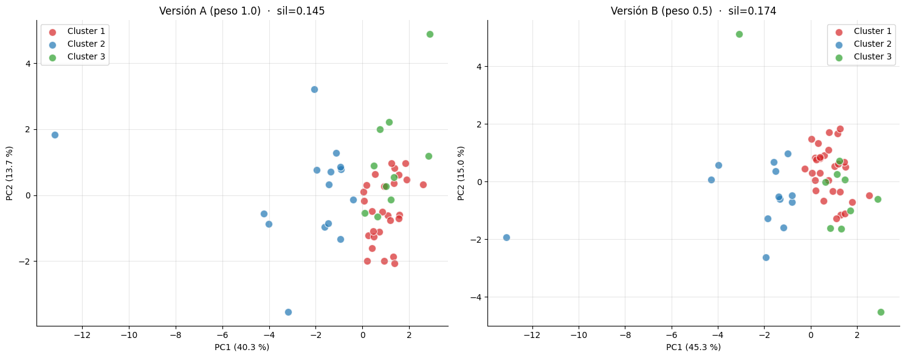

# Resumen de clustering — Entrega III

Este documento sintetiza el **modelo de clustering principal de la tesis**: el GMM sobre espacio mixto del notebook `05_clustering_intermedio.ipynb` (variante A, peso de binarias = 1.0), de aquí en más **modelo 05A**. Acompaña a `resumen_eda.md` y constituye la base analítica de la Entrega III.

El proceso de selección entre modelos alternativos (K-Means del nb 03, GMM sobre continuas del nb 04, Ward, DBSCAN, y las variantes de ponderación) se documenta por separado en `resumen_clustering_alternativo.md`. Acá se da por establecido el 05A y se lo caracteriza.

## 1. Insumos y diseño del experimento

- **Panel**: promedio de los tres cortes (Dic-2023, Dic-2024, Dic-2025) del `panel_ratios.csv`, complementado con la oferta de productos por banco (`oferta_banco.csv`).
- **Universo de bancos**: se parte de 56 entidades y se excluyen 4 bancos mayoristas/extranjeros sin cartera minorista relevante (Bank of China, JPMorgan, BNP Paribas, Cetelem). Queda un panel de **52 bancos**.
- **Features (21)** en un **espacio mixto**:
  - **10 continuas** (`log_activo`, `prestamos_sobre_activo`, `titulos_sobre_activo`, `depositos_sobre_activo`, `patrimonio_sobre_activo`, `roa`, `liquidez`, `eficiencia`, `cartera_irregular`, `log_activo_por_empleado`), transformadas con **`log1p`** sobre las sesgadas (liquidez, cartera_irregular, eficiencia) y escaladas con **RobustScaler**.
  - **11 binarias de oferta** (caja de ahorro pesos/USD, cuenta corriente, plazo fijo, tarjeta crédito/débito, préstamo personal/hipotecario/prendario, paquete, premium, etc.), concatenadas **sin escalar con peso = 1.0**.
- **Imputación**: missings en `cartera_irregular` y `n_productos_ofrecidos` se reemplazan por la mediana del panel.
- **Algoritmo**: **Gaussian Mixture Model (GMM)** con `k=3`, `covariance_type="full"`, sobre el espacio mixto.

**Por qué GMM sobre espacio mixto** (resumen; el argumento completo está en `resumen_clustering_alternativo.md`):
- El GMM da **probabilidades de pertenencia** (no solo etiqueta dura), lo que habilita análisis de transiciones temporales y de bancos "borde".
- El **espacio mixto** recupera la dimensión de oferta comercial que el balance solo no captura, distinguiendo modelos de negocio que el tipo administrativo de entidad pasa por alto.
- Maneja el outlier estructural (Banco de Servicios Financieros) integrándolo con probabilidad ~1.0 a su cluster, sin exclusión manual.

## 2. PCA — interpretación de los ejes

La proyección sobre los dos primeros componentes principales del espacio mixto explica **~54 % de la varianza** (PC1 40.3 %, PC2 13.7 %). Se necesitan ~7 componentes para llegar al 90 %, lo que confirma que la heterogeneidad del sistema bancario argentino es genuinamente multidimensional y no se reduce a un único eje "tamaño".

*Figura 1. Proyección PCA de los 52 bancos coloreada por cluster del GMM. Izquierda: modelo 05A (peso binarias = 1.0, silhouette 0.145). El panel derecho (variante B, peso 0.5) se discute en el comparativo.*

- **PC1 — Sofisticación retail / escala de fondeo minorista**. Separa la banca minorista masiva (derecha) de los bancos chicos/especializados (izquierda).
- **PC2 — Productividad operativa vs. exposición minorista**. Separa la banca corporativa/mayorista (productividad alta, poca cartera) de la minorista con mucho crédito y mora.

La nube es **continua**, sin huecos limpios entre grupos: visualmente se aprecia el solapamiento que explica el silhouette bajo y que la validación supervisada (nb 06) confirma como "fronteras borrosas pero perfiles reales".

## 3. Los tres perfiles del modelo 05A

Distribución **27 / 15 / 10**. Las etiquetas se confirmaron a posteriori con el clasificador del nb 06 (ver `resumen_clasificador.md`).

| Cluster | Tamaño | Perfil mediano (variables de resultado) | Lectura |
|---|---|---|---|
| **0 — Minoristas masivos** | 27 | ROA 3.1 %, depósitos 66 % del activo, eficiencia 43 %, oferta retail completa | Núcleo del sistema tradicional. Galicia, Nación, BBVA, Santander, todos los públicos provinciales, Macro, Patagonia, Supervielle, Credicoop. |
| **1 — Chicos en transformación** | 15 | ROA −2.3 %, eficiencia 80 % (cost-to-income malo), cartera irregular 4.3 % | Bancos chicos minoristas con rentabilidad débil. Incluye **los 4 digitales** (Brubank, Uala, Voii, Dino) + consumer finance (Servicios Financieros, Columbia, Sucrédito, Masventas) + privados chicos con dificultades. |
| **2 — Mayoristas/inversión** | 10 | ROA 3.2 %, eficiencia 30 %, depósitos solo 45 % del activo, cartera irregular 0.6 % | Banca corporativa y de mercado de capitales. Citibank, Banco de Valores, Mariva, BICE, CMF, BACS. Casi no ofrecen productos minoristas. |

### Caracterización por dimensión económica (esquema choice/outcome)

Siguiendo a Roengpitya et al. (2014), las **variables de elección** (estructura de balance + oferta) definen los grupos y las **de resultado** (rentabilidad, costos) los caracterizan a posteriori:

- **Rentabilidad (resultado)**: minoristas y mayoristas comparten ROA sano (~3 %); los chicos en transformación tienen ROA negativo. La rentabilidad **no separa** minoristas de mayoristas — lo hace la estructura.
- **Riesgo crediticio (resultado)**: la cartera irregular es **mínima** en mayoristas (0.6 %, casi no prestan a retail) y moderada en los otros dos clusters. La ausencia de mora es, justamente, la variable que más define al cluster mayorista (ver SHAP, nb 06).
- **Estructura de fondeo (elección)**: depósitos/activo 66 % (minoristas) vs. 45 % (mayoristas) — el eje primario de diferenciación de modelo de negocio.
- **Escala (elección/control)**: los minoristas masivos concentran los bancos más grandes; los otros dos son sistemáticamente más chicos.
- **Oferta comercial (elección)**: minoristas ofrecen paquetes premium e hipotecas; mayoristas casi no ofrecen productos retail; los chicos ofrecen personales pero no hipotecas.

## 4. Observaciones estructurales

1. **El tipo de entidad (público/privado/extranjero) no estructura los clusters.** Los públicos provinciales y los privados grandes comparten el cluster minorista cuando comparten modelo de negocio. La propiedad no es el eje de segmentación; el modelo de negocio sí.

2. **El sub-grupo digital queda identificado.** Los 4 bancos 100 % digitales (Brubank, Uala, Voii, Dino) caen juntos dentro del cluster "Chicos en transformación", anidados en un perfil más amplio de bancos chicos con productos de consumo y rentabilidad débil. El 05A es el único modelo que los mantiene agrupados **sin perder** la distinción mayorista/minorista (ver comparativo).

3. **Banco de Servicios Financieros es un outlier estructural, no un error de datos.** Su balance (liquidez 1622 %, depósitos 0.3 %, financiación 100 % con capital propio) refleja un modelo de consumer finance puro (Frávega). El GMM lo integra al cluster de chicos con probabilidad ~1.0.

4. **Las fronteras son borrosas pero los perfiles son reales.** El silhouette bajo (0.145) refleja solapamiento genuino: hay un continuo de bancos "entre" perfiles (BICA, BancoSol). La validación supervisada del nb 06 (accuracy 0.867 en CV anidado) confirma que la partición es predecible y reproducible desde las features — no es artefacto del GMM.

## 5. El silhouette como métrica complementaria, no decisoria

El silhouette de 0.145 está muy por debajo del umbral 0.50 que indicaría estructura geométrica fuerte. Esto **no** descalifica al modelo:

- El silhouette mide compactness geométrica. En un espacio de 21 dimensiones con perfiles que se diferencian por **combinaciones** de features (paquete + hipoteca + premium) y no por una variable que separe nítidamente, agregar dimensiones siempre reduce el silhouette ("maldición de la dimensionalidad").
- El sistema bancario argentino tiene **continuos genuinos** entre perfiles; cualquier partición discreta tendrá silhouette bajo.
- La elección del modelo se sostiene en **interpretabilidad sustantiva + validación supervisada independiente** (nb 06), no en la métrica geométrica.

En la tesis, el silhouette se reporta junto a Davies-Bouldin como métricas internas complementarias (siguiendo a Mercadier et al., 2025), pero la decisión de modelo se argumenta con el clasificador supervisado.

## 6. Síntesis para la tesis

1. **El modelo 05A (GMM k=3 sobre espacio mixto) es el modelo principal.** Identifica tres modelos de negocio: minoristas masivos, chicos en transformación (con el sub-grupo digital) y mayoristas/inversión.
2. **El tipo de entidad no segmenta**; el modelo de negocio sí.
3. **La partición es real aunque las fronteras sean borrosas** — validado por el clasificador del nb 06.
4. **El GMM aporta probabilidades de pertenencia**, base para el análisis de transiciones temporales y para clasificar cortes futuros.

## 7. Limitaciones y próximos pasos

- El silhouette de 0.145 es bajo en términos absolutos: hay solapamiento real, muchos bancos están "entre" perfiles. Es información sustantiva, no falla del algoritmo.
- El promedio de los tres cortes oculta dinámica temporal. Extensión natural: analizar transiciones de cluster entre Dic-23 → Dic-25 usando las probabilidades del GMM.
- Las binarias de oferta capturan **disponibilidad**, no **volumen ni precio**. Próximo paso: incorporar tasas y comisiones de `oferta_banco.csv` como variables continuas.
- La validación supervisada confirma la partición pero **no** prueba que k=3 sea óptimo ni que GMM-A supere a las alternativas en sentido absoluto (ver `resumen_clustering_alternativo.md` para esa discusión).
